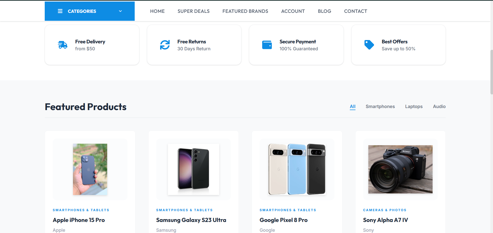
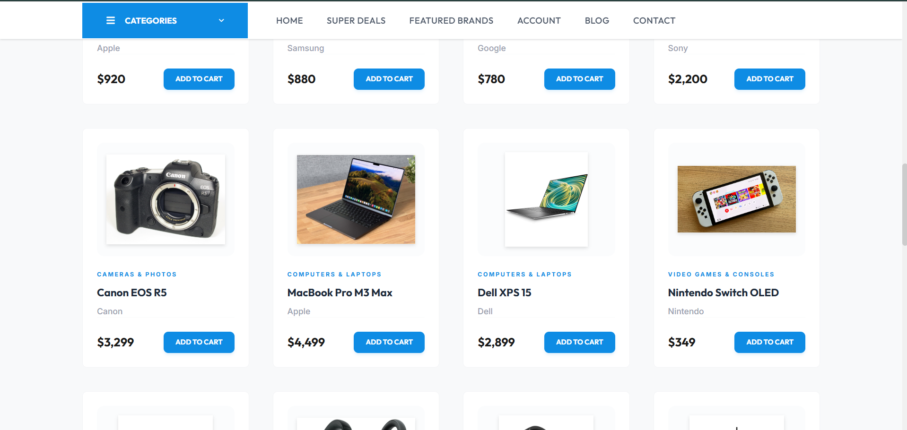
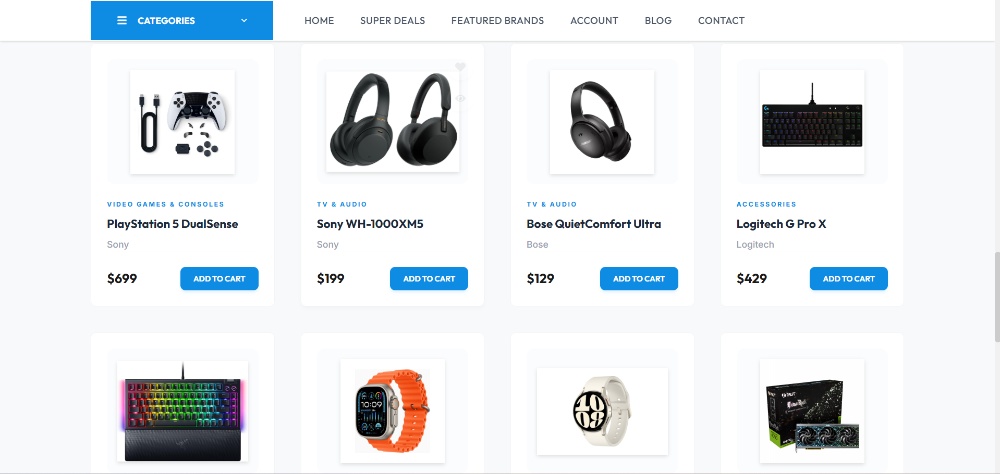
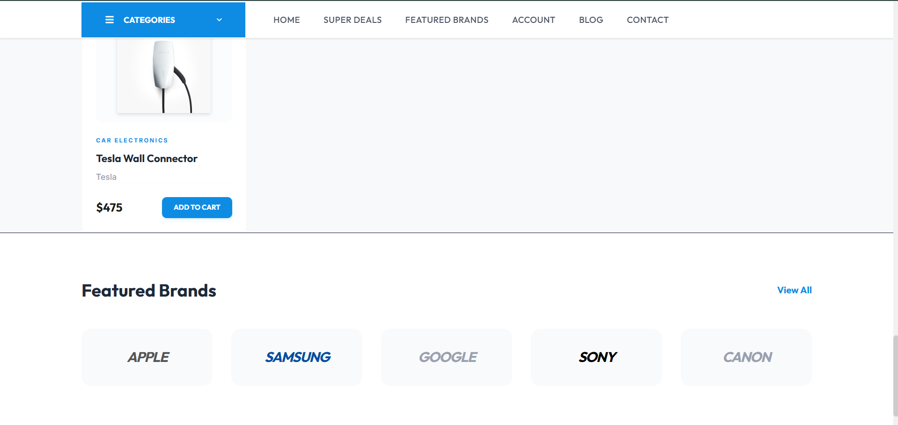
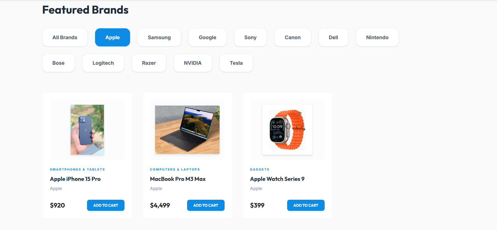
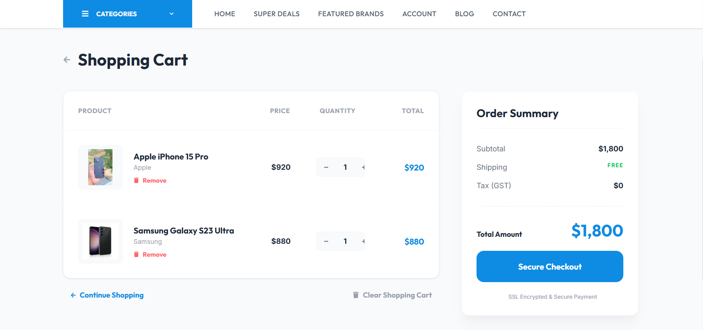
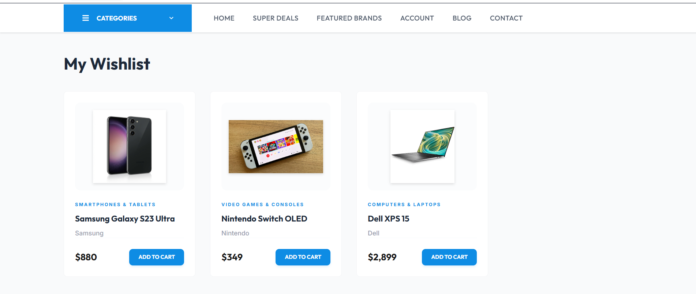
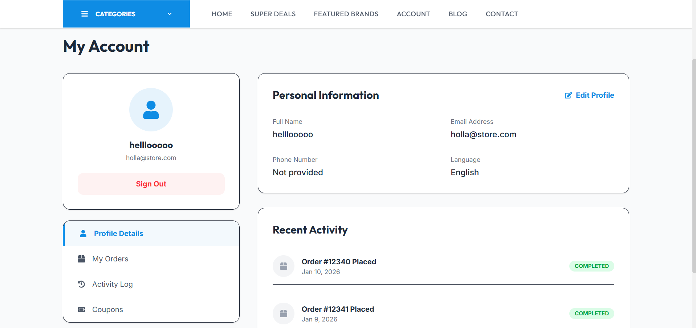
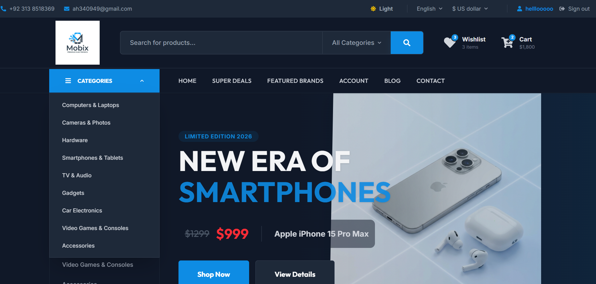

# MoBix | Premium E-Commerce Store

**MoBix** is a high-end, professional MERN stack e-commerce platform specializing in premium electronics, mobile phones, and accessories. It features a modern, responsive UI with deep integration for user authentication, product management, and real-time shopping functionality.

---

## 🌟 Key Features

### 🎨 Design & UX
- **Dynamic Dark/Light Mode**: Full support for system preferences and manual toggle with smooth transitions.
- **Premium Hero Section**: Immersive animations with transparent overlays for high-end product showcasing.
- **Grid Layout**: Responsive product grids with hover effects and quick actions.

### 🔐 User Experience
- **Secure Authentication**: Complete login and registration system with persistent sessions (reloads don't sign you out).
- **Advanced Registration**: Collects Full Name, Email, Phone Number, and Secure Passwords.
- **Personal Account Page**: Users can manage profile details and view a stylized activity log.

### 🛒 Shopping Functionality
- **Fully Functional Cart**: Real-time quantity increments/decrements, subtotal calculations, and item persistence.
- **Wishlist System**: Add/remove products to a personalized wishlist with a dynamic counter.
- **Brands Filtering**: Dedicated section to filter products by top brands like Apple, Samsung, Sony, etc.
- **Super Deals**: A curated page for products with active discounts and promotional pricing.

---

## 🛠️ Tech Stack

**Frontend:**
- **React.js**: Modular component-based architecture.
- **Tailwind CSS 4**: Modern utility-first styling with premium design tokens.
- **React Router DOM**: Seamless client-side navigation.
- **React Hot Toast**: Beautiful, non-intrusive notifications.
- **Context API**: Global state management for Auth, Cart, and App settings.

**Backend:**
- **Node.js & Express**: High-performance REST API.
- **MongoDB & Mongoose**: Flexible NoSQL database for products and user data.
- **JWT (JSON Web Tokens)**: Secure stateless authentication.
- **Bcrypt**: Industrial-grade password hashing.

---

## 📂 Project Structure

```text
MoBix/
├── backend/                # Express Server & API
│   ├── controllers/        # Logical handlers for routes
│   ├── models/             # Mongoose Schemas (User, Product)
│   ├── routes/             # API Endpoint definitions
│   ├── seed.js             # Database initialization script
│   └── server.js           # Entry point
├── mobix-frontend/         # React Application
│   ├── src/
│   │   ├── components/     # Reusable UI elements
│   │   ├── context/        # Cart & App State
│   │   ├── pages/          # Main page views
│   │   └── assets/         # Images & Branding
│   └── public/
│       └── images/         # Static product assets
└── README.md
```

---

## 🚀 Getting Started

### Prerequisites
- Node.js (v16 or higher)
- MongoDB account (Atlas or Local)

### 1. Setup Backend
```bash
cd backend
npm install
```
Created a `.env` file in the `backend/` directory:
```env
PORT=5000
MONGO_URI=your_mongodb_connection_string
JWT_SECRET=your_secret_key
```
Seed the database with initial products:
```bash
node seed.js
```
Start the server:
```bash
npm start
```

### 2. Setup Frontend
```bash
cd mobix-frontend
npm install
npm run dev
```

---

## 📸 Screen Shots

### 🏠 Home & Features
1. **Hero Section** - Dynamic and immersive animations.


2. **Featured Products** - Elegant product grid with quick actions.




3. **Brands Section** - Professional brand showcasing.


### 🛒 User Experience
4. **Shopping Cart** - Multi-product management and checkout flow.


5. **Wishlist** - Save your favorites for later.


6. **Account Page** - Personal profile and activity log.


### 🌓 Aesthetics
7. **Premium Dark Mode** - Sleek, high-contrast digital experience.


---

This project is developed as part of an Internship project.
